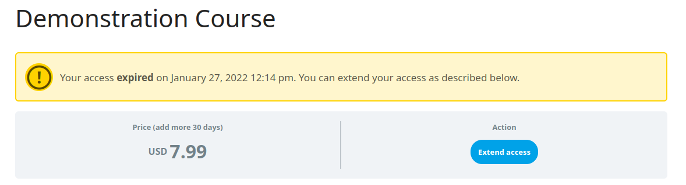

# learndash-extend-expiry

Allow user purchase a course extension for a LearnDash course with a fixed expiry date.

[](https://github.com/estevao90/learndash-extend-expiry/actions?query=workflow%3AIntegration)

## Screenshots

Allow to configure the extended access parameters for each course:


Expired access warning with an action to extend access, when the user tries to access a expired course (free and paid version):




Configurable expire warning to alert user before course expiration:


Paypal Integration with configurable notify URL to allow local tests:


## Development

```sh
# install dependencies
composer install
npm install
```

### Test PayPal IPN integration

Use [localtunnel](https://github.com/localtunnel/localtunnel) to test PayPal IPN.

```sh
# install localtunnel
npm install -g localtunnel

# start tunnel to port 80
# put the generated url in the LD PayPal settings configurations in the "PayPal Notify URL" options
# example: https://swift-eagle-45.loca.lt/sfwd-lms/paypal
lt -p 80 --print-requests true
```

### Helpful Commands

```sh
# PHP WordPress lint
composer php:lint

# fix PHP fixable errors
composer php:fix

# same to js
composer js:lint
composer js:fix

# run all lints
composer lint

# run all fixes
composer fix
```

## Some future improvements

- Configure CSS linting
- Add a GitHub Action to automatically generate the zip file of the plugin
- Add a GitHub Action to automatically publish the plugin to the WordPress.org repository
- Code refactor to render the expiry warning through template
- Add Stripe Integration
